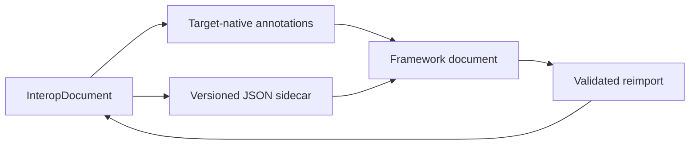

# Loss-aware NLP interoperability

pyaegean can exchange aligned Ancient Greek analyses with spaCy `Doc`, Stanza
`Document`, and current CLTK `Doc` objects. The adapters keep the zero-dependency
core intact: target libraries are imported only when their adapter is called.

```bash
pip install "pyaegean[spacy]"
pip install "pyaegean[stanza]"   # includes Stanza's PyTorch dependency
pip install "pyaegean[cltk]"     # CLTK 2.5.1 requires Python 3.13+
pip install "pyaegean[interop]"  # spaCy + Stanza; CLTK is included on Python 3.13+
pip install "pyaegean[cli,interop]"  # adapters plus the interop CLI commands
```

These extras are separate from `[all]`, whose pyaegean neural runtime remains
torch-free ONNX.

## One canonical document, two target layers

The structural source of truth is the complete `UDDocument` row stream. An
`InteropDocument` adds more when those values exist: exact source alignment,
typed editorial forms, confidence, and receipts. It also carries the inference
annotation-profile identity, any composed output-profile identity, and
provenance. Fields a target cannot represent are carried in the
canonical `aegean.interop/v1` JSON sidecar. The v1 sidecar carries profile identities
through receipts; it does not embed custom profile objects.



An `InteropReport` lists fields stored natively, fields retained in the sidecar,
and fields genuinely lost. `lossless` is true only when the last list is empty.
The sidecar and native projection are SHA-256-bound, so stale, mismatched, or
hash-inconsistent pairings fail cleanly. This is an integrity check.

| Capability | spaCy | Stanza | CLTK |
| --- | --- | --- | --- |
| Words, lemma, POS, morphology, basic dependencies | native | native | native |
| Sentence boundaries | native starts | native IDs/order | native spans |
| Exact arbitrary whitespace/source alignment | sidecar | native where supported + sidecar | exact raw offsets + sidecar |
| MWT ranges | sidecar | native + sidecar | sidecar |
| Empty nodes, opaque rows, exact row order | sidecar | sidecar | sidecar |
| Confidence, receipt, inference/output profile identity, provenance | sidecar | sidecar | selected native metadata + sidecar |

Strict framework import refuses missing, mismatched, or hash-inconsistent sidecars. Plain native CoNLL-U
without a sidecar remains a valid native-only import. `allow_lossy=True` is an
explicit projection request and returns the exact lost-field list.

## Serializer boundaries

- spaCy `DocBin` keeps the sidecar only with `store_user_data=True`.
- Stanza's generic serializers promise standard fields, not custom properties;
  retain the returned sidecar or the portable adapter bundle.
- CLTK stores the sidecar under a namespaced `Doc.metadata` key and also returns
  it separately.

The CLI's `aegean greek interop export|import|report` commands use a documented
JSON bundle containing the target-native projection, sidecar, and report. It is
portable and inspectable, and is not presented as a framework-specific binary
format.

The adapters move existing analysis. They do not invoke a model, convert treebank
conventions, or turn preserved gold MWT/empty-node structure into a prediction. The
annotation registry exposes declared diagnostic mappings, but no adapter applies a
source-compatible profile conversion.
