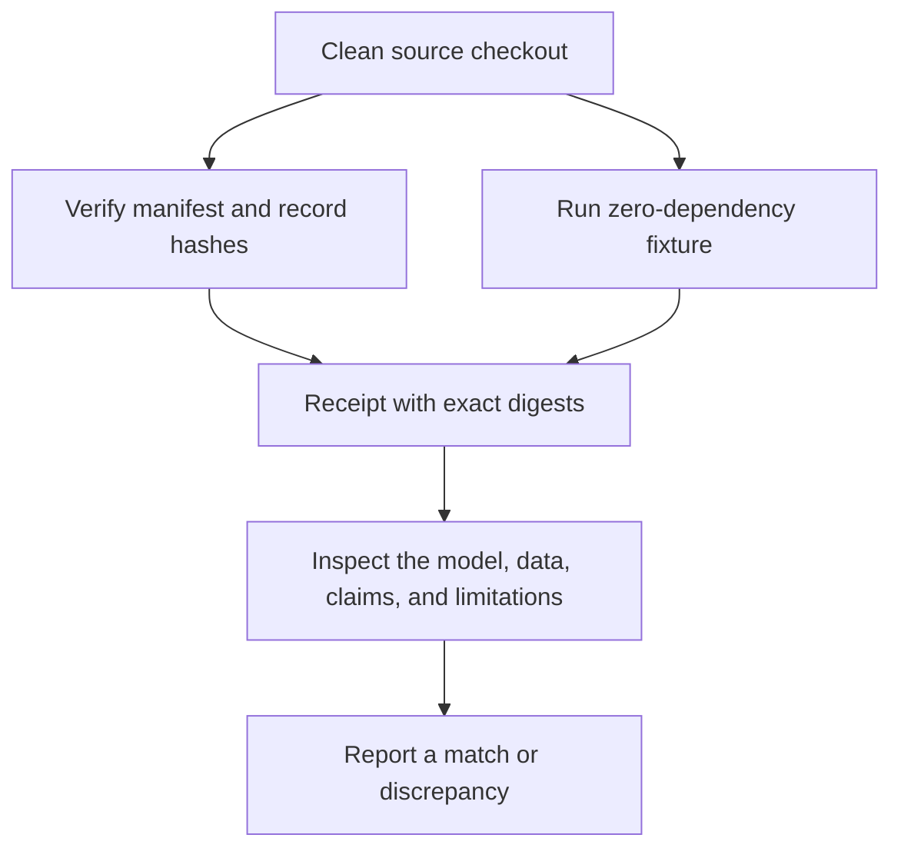

# Independent review

pyaegean includes a bounded, one-command review path for people who want to check
the public evidence before reading the rest of the repository:

```bash
git clone https://github.com/ryanpavlicek/pyaegean.git
cd pyaegean
python scripts/reproduce_review.py
```

The command supports CPython 3.10 through 3.14. It uses the standard library and
the checked-out zero-dependency source. It verifies a canonical SHA-256 manifest
whose records explicitly choose byte-exact or cross-platform canonical-LF hashing,
runs the project-authored offline regression fixture and one baseline Greek
sentence, and compares the result byte-for-byte with the reviewed expectation. It
also reports the Git commit and whether the checkout is clean when Git is available.

It does **not** download or run the neural model, use the network, write bytecode,
or create a pyaegean cache. The fixture result is not a neural accuracy claim.
Reproducing the published neural rows requires the complete pinned protocol on the
[Benchmarks](benchmarks.md) page.



## Reading the receipt

A pass says two bounded things:

1. Every public record in the review manifest has the reviewed bytes.
2. The deterministic offline journey has the reviewed result on this interpreter.

It does not certify the scholarly interpretation of a source, rerun a large model,
or turn an internal check into outside peer review. `--json` prints the complete
machine-readable receipt. `--allow-dirty` is available for local diagnosis, but a
dirty run is not clean reproduction evidence.

## What to inspect next

The repository's [independent review kit](https://github.com/ryanpavlicek/pyaegean/tree/main/review)
contains the canonical manifest, a model card, a data card, an evidence map, a
limitations matrix, and the discrepancy-report path. The measured-value registry is
[`training/results/published-claims.json`](https://github.com/ryanpavlicek/pyaegean/blob/main/training/results/published-claims.json),
while this site's [Methodology](methodology.md) page explains the data, architecture,
evaluation, and review rules in full.

The model card identifies the shipped artifact and intended use. The data card
describes training/evaluation roles, separation, licenses, and coverage limits. The
wiki's [Validation and review](https://github.com/ryanpavlicek/pyaegean/wiki/Validation-and-Review)
page states what has and has not had outside review, and
[Limitations](https://github.com/ryanpavlicek/pyaegean/wiki/Limitations) keeps the
full boundary register.

## Reporting a mismatch

Open an [independent-review discrepancy](https://github.com/ryanpavlicek/pyaegean/issues/new?template=reproduction_discrepancy.yml)
with the exact command, package version, Git commit or source-archive hash, manifest
SHA-256, deterministic-result SHA-256, environment, observed output, and all local
modifications. A discrepancy is evidence to investigate, not a result to conceal.

Prospective maintainers can start with the bounded ownership slices in
[`CONTRIBUTING.md`](https://github.com/ryanpavlicek/pyaegean/blob/main/CONTRIBUTING.md).
