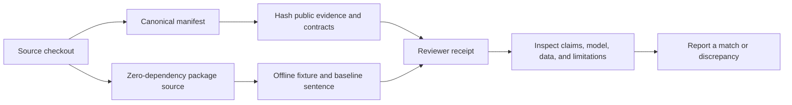

# Independent review kit

This directory is the shortest public path for checking pyaegean's evidence and
deciding what to examine next. From a source checkout, run:

```bash
python scripts/reproduce_review.py
```

The command supports CPython 3.10 through 3.14 and uses only the standard library
plus the checked-out, zero-dependency package source. It:

- rejects a modified checkout by default and reports the exact Git commit when Git
  is available;
- verifies every file in the canonical manifest by SHA-256, using the record's
  declared byte-exact or canonical-LF text mode;
- runs the project-authored offline benchmark fixture and one ordinary baseline
  Greek-pipeline example;
- compares the complete result with the checked-in expectation; and
- prints the manifest and result digests needed for a discrepancy report.

It does not use the network, download or execute a model, write bytecode, or create
a pyaegean cache. Use `--json` for a machine-readable receipt. Use `--allow-dirty`
only while diagnosing a local change; a dirty run is not a clean reproduction.

## What a passing result means

A pass means that the bounded records named in
[`review-manifest-v1.json`](review-manifest-v1.json) have their reviewed bytes and
that the small deterministic package journey matches its reviewed result. This is a
tamper-evident receipt, not a claim that every number has been independently rerun.

The offline benchmark is a project-authored regression fixture. Its counts are not
the published neural accuracy rows. The neural rows require a separately downloaded
model, pinned evaluation data, ONNX Runtime, and the complete protocol in
[`docs/benchmarks.md`](../docs/benchmarks.md). No passing command can substitute for
examining the protocol, data, code, or scholarly assumptions.



## Evidence map

| Question | Canonical record |
| --- | --- |
| Which measured values are published? | [`training/results/published-claims.json`](../training/results/published-claims.json) |
| How were the neural values measured? | [`docs/benchmarks.md`](../docs/benchmarks.md) |
| What is the shipped model and what should it be used for? | [Model card](MODEL_CARD.md) |
| Which data trained and evaluated it? | [Data card](DATA_CARD.md) |
| Which neural artifact does `default` mean? | [`neural-runtime-variants.json`](../src/aegean/data/bundled/greek/neural-runtime-variants.json) |
| What policy can award future runtime labels? | [`runtime-variant-policy-v1.json`](../training/runtime-variant-policy-v1.json) |
| Is the intended training environment fully resolved? | [Normalized environment evidence](../training/results/a17-environment/evidence-summary.json) |
| What is known not to work or not to be known? | [Limitations register](https://github.com/ryanpavlicek/pyaegean/wiki/Limitations) |
| What has and has not received outside review? | [Validation and review](https://github.com/ryanpavlicek/pyaegean/wiki/Validation-and-Review) |

The manifest is the authoritative list of files checked by the command. The table is
an orientation aid, not a second manifest.

## Limitations to examine first

| Area | Current boundary | Canonical detail |
| --- | --- | --- |
| Linear A and Cypro-Minoan | Undeciphered; analytical and generated results are exploratory | [Limits of the evidence](https://github.com/ryanpavlicek/pyaegean/wiki/Limitations#limits-of-the-evidence-not-fixable-by-code) |
| Fetched corpora and model | Some assets are kept out of the wheel because of size or license terms | [Limits of licensing](https://github.com/ryanpavlicek/pyaegean/wiki/Limitations#limits-of-licensing-fixable-only-by-permission) |
| Baseline Greek NLP | The no-download rules are useful floors, not the accuracy tier | [Measured accuracy boundaries](https://github.com/ryanpavlicek/pyaegean/wiki/Limitations#measured-accuracy-boundaries) |
| Neural Greek NLP | Accuracy changes by domain and annotation convention | [`docs/benchmarks.md`](../docs/benchmarks.md) |
| Shipped v3 parser | Bare apposition may be labeled `cc` because of an old training conversion | [Measured accuracy boundaries](https://github.com/ryanpavlicek/pyaegean/wiki/Limitations#measured-accuracy-boundaries) |
| Runtime variants | Only `default` is available; other labels are reserved until earned | [`neural-runtime-variants.json`](../src/aegean/data/bundled/greek/neural-runtime-variants.json) |
| Generative AI | Output is exploratory and provider-dependent | [By-design limits](https://github.com/ryanpavlicek/pyaegean/wiki/Limitations#by-design-documented-trade-offs-not-on-the-roadmap) |
| Outside review | The project's code and integrated conclusions have not had formal external review | [Validation and review](https://github.com/ryanpavlicek/pyaegean/wiki/Validation-and-Review#what-has-had-outside-review-and-what-has-not) |

## Reporting a discrepancy

Use the [reproduction-discrepancy issue form](https://github.com/ryanpavlicek/pyaegean/issues/new?template=reproduction_discrepancy.yml).
Include the command, package version, Git commit or source-archive identity, manifest
SHA-256, deterministic-result SHA-256, environment, and complete observed error. State
every local modification. A disagreement is useful evidence and will not be treated as
an inconvenience to hide.

Prospective maintainers can choose a bounded ownership slice in
[`CONTRIBUTING.md`](../CONTRIBUTING.md) and use the maintainer-task issue form to
define the files, acceptance evidence, and non-goals before work begins.
