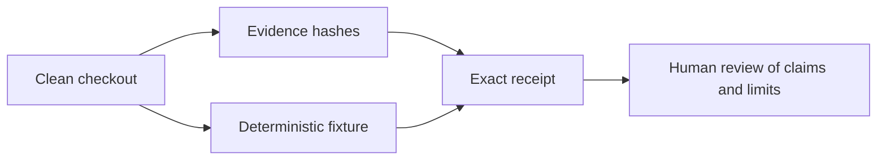

# Independent review

The repository includes a small review kit that makes the first reproduction step
one command:

```bash
git clone https://github.com/ryanpavlicek/pyaegean.git
cd pyaegean
python scripts/reproduce_review.py
```

It runs on CPython 3.10 through 3.14 with the standard library and the checked-out
zero-dependency package source. The command verifies the SHA-256 of every record in
the canonical review manifest using its declared byte-exact or canonical-LF mode,
runs the project-authored offline benchmark fixture
and one ordinary baseline-pipeline sentence, and compares the exact result with the
reviewed expectation. When Git is available, it also identifies the commit and
rejects a dirty checkout by default.

The verifier does not use the network, download or run the neural model, write
bytecode, or create a pyaegean cache. The offline fixture is a regression test, not
the published neural benchmark: reproducing the neural measurements needs the
separate pinned protocol in [Benchmarks](Benchmarks).

## What a pass establishes



A pass establishes that the public records have their reviewed bytes and that the
small deterministic result matches. It does not establish that an interpretation is
correct, rerun every benchmark, or amount to external peer review. Use `--json` for
the complete receipt. `--allow-dirty` is for diagnosis only.

## Review map

| Start here | What it answers |
| --- | --- |
| [Review kit](https://github.com/ryanpavlicek/pyaegean/tree/main/review) | One-command instructions, exact manifest, model card, data card, and receipt map |
| [Benchmarks](Benchmarks) | Measured values, sample sizes, protocols, and comparisons |
| [Methodology](Methodology) | Data, architecture, evaluation, leakage, and review methods |
| [Data and Provenance](Data-and-Provenance) | Dataset origins, licenses, hashes, and cache boundaries |
| [Limitations](Limitations) | Known evidence, licensing, accuracy, and design boundaries |
| [Validation and Review](Validation-and-Review) | What has and has not received outside review |

## Report a discrepancy

Open the [independent-review discrepancy form](https://github.com/ryanpavlicek/pyaegean/issues/new?template=reproduction_discrepancy.yml)
and include the exact command, version, Git commit or source-archive hash, manifest
digest, deterministic-result digest, environment, observed output, and every local
modification. Record a mismatch exactly; it is useful evidence.

People interested in maintenance can choose an ownership slice in
[`CONTRIBUTING.md`](https://github.com/ryanpavlicek/pyaegean/blob/main/CONTRIBUTING.md)
before taking on a larger change.
