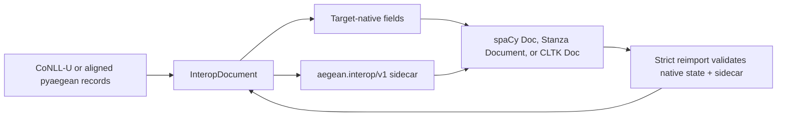

# Interoperability with spaCy, Stanza, and CLTK

pyaegean can move an aligned Ancient Greek analysis into and out of the document
objects used by spaCy, Stanza, and CLTK. The adapters are intended for comparison,
substitution, and mixed-tool research workflows. They do not make pyaegean a wrapper
around those frameworks, and they do not claim that every framework has the same data
model.

> **Available in pyaegean 0.50.0.** The adapters preserve a complete pyaegean document with a
> versioned sidecar and report exactly which fields are native to the target, retained
> in the sidecar, or lost by an explicitly requested projection.

## Install only the target you use

```bash
pip install "pyaegean[spacy]"       # spaCy Doc adapter
pip install "pyaegean[stanza]"      # Stanza Document adapter; Stanza installs PyTorch
pip install "pyaegean[cltk]"        # current CLTK Doc/Process adapter; Python 3.13+
pip install "pyaegean[interop]"     # spaCy + Stanza; CLTK is included on Python 3.13+
pip install "pyaegean[cli,interop]" # adapters plus the interop CLI commands
```

These extras are deliberately separate from `pyaegean[all]`. The pyaegean neural
pipeline remains a torch-free ONNX runtime; installing the Stanza adapter is the action
that brings in Stanza's separate PyTorch dependency. CLTK 2.5.1 requires Python 3.13 or
newer upstream. The rest of pyaegean, including the spaCy and Stanza adapters, retains
the project's Python 3.10 floor.

Importing `aegean` or `aegean.io` does not import any of the three frameworks. A missing
target dependency produces a short install hint only when its adapter is called.

## What “lossless” means here

The structural source of truth is pyaegean's complete CoNLL-U document model: comments,
all ten columns, multiword-token ranges, empty nodes, enhanced dependencies, MISC,
opaque lenient rows, and original line endings. An `InteropDocument` adds source text,
stable source alignment, typed editorial forms, confidence, analysis receipts, the
annotation-profile identity, and provenance when those values exist.

No target document type natively represents all of that. Each export therefore has two
parts:

1. the target's ordinary document object, populated with every field it represents;
2. a canonical `aegean.interop/v1` JSON sidecar for the remaining fields.

An `InteropReport` separates `native_fields`, `sidecar_fields`, and `lost_fields`.
`report.lossless` is true only when `lost_fields` is empty. The sidecar and native
projection are hash-bound, so stale, mismatched, or hash-inconsistent token order,
text, offsets, annotations, and sidecar data make strict reimport fail instead of
silently pairing unrelated data. This detects integrity errors; it is not a digital
signature or proof of authorship.



In plain language: the framework object stays useful to that framework, while the
sidecar prevents its narrower schema from erasing research data on the trip back.

## Field support by target

“Sidecar” means the value round-trips exactly but is not advertised as a native target
annotation.

| Field | CoNLL-U | spaCy `Doc` | Stanza `Document` | CLTK `Doc` |
| --- | --- | --- | --- | --- |
| Token text, lemma, UPOS/XPOS, morphology | native | native | native | native |
| Basic dependency head and relation | native | native | native | native |
| Sentence order and boundaries | native comments/order | native starts; IDs in sidecar | native, including `sent_id` | native boundaries; IDs in sidecar |
| Exact arbitrary whitespace and source offsets | sidecar when supplied | sidecar; spaCy has a boolean trailing-space projection | native when the object supports the exact offsets/spaces, plus sidecar | native raw offsets when the basis is exact, plus sidecar |
| Multiword-token ranges | native | sidecar | native token ranges, plus sidecar for exact row state | sidecar |
| Empty nodes and opaque rows | native | sidecar | sidecar | sidecar |
| Enhanced dependencies and ordered MISC | native | sidecar | native word strings where supported, exact state in sidecar | sidecar |
| Typed editorial form state | native reserved MISC + sidecar | sidecar | sidecar | sidecar |
| Calibrated confidence and abstention evidence | sidecar | sidecar | sidecar | selected native confidence/source fields + complete sidecar |
| Analysis receipt, profile identity, provenance | sidecar | sidecar | sidecar | namespaced metadata sidecar |

The adapters never infer offsets with `str.find()`. Repeated words, combining marks, and
normalization make that unsafe; exact alignment must already be present or the report says
it is unavailable.

## Python workflow

```python
from pathlib import Path

from aegean.io import from_conllu, from_spacy, to_spacy

canonical = from_conllu(Path("treebank.conllu")).value
exported = to_spacy(canonical)

doc = exported.value                 # a normal spacy.tokens.Doc
exported.report.lossless             # True: narrower fields live in the sidecar
exported.report.sidecar_fields       # exact machine-readable disclosure

restored = from_spacy(doc, sidecar=exported.sidecar).value
restored.ud_document.dumps()         # the complete canonical document is back
```

The Stanza and CLTK pairs use the same shape:
`to_stanza` / `from_stanza` and `to_cltk` / `from_cltk`. Conversion does not run a
model or download data. It moves annotations that already exist.

Strict framework import mode is the default. If a framework object has lost its sidecar, reimport raises
`InteropLossError`. A caller that deliberately wants only the surviving native projection
can opt in:

```python
projected = from_spacy(doc_without_sidecar, allow_lossy=True)
print(projected.report.lost_fields)
```

That result is useful for exchange, but it is not called lossless.

## Portable adapter bundles from the CLI

Framework objects often have version-specific binary serializers, so the CLI uses an
explicit JSON adapter bundle instead of pretending to write a spaCy, Stanza, or CLTK
binary file. The bundle contains the target-native JSON projection, the canonical sidecar,
target/version information, and the same loss report.

```bash
aegean greek interop export treebank.conllu --target spacy -o treebank.spacy.json
aegean greek interop report treebank.spacy.json
aegean greek interop import treebank.spacy.json -o treebank-restored.conllu
```

`export` requires the selected target extra so it can construct and verify the real object.
`report` and `import` validate the portable bundle without loading a model. The imported
CoNLL-U is the complete sidecar-backed document, not merely the target's word projection.

## Serializer caveats

- spaCy `Doc.to_bytes()` carries `Doc.user_data`. `DocBin` carries it only when created
  with `store_user_data=True`; the default `False` is a lossy choice for these adapters.
- Stanza's standard `to_dict()` and `to_serialized()` promise its standard annotation
  fields, not arbitrary custom properties. Keep the adapter's returned sidecar or the CLI
  bundle alongside serialized Stanza data.
- CLTK has a documented free-form `Doc.metadata` mapping, where the namespaced sidecar is
  stored. The adapter still returns it separately so integrity checks do not depend on an
  application preserving unrelated metadata.
- Removing or editing the sidecar is never repaired heuristically. Strict framework import fails;
  explicit projection names what is gone.

## CLTK pipeline integration

`make_cltk_process(...)` creates a CLTK-compatible process around an explicitly supplied
pyaegean pipeline instance. It preserves unrelated CLTK document metadata and does not
activate a global backend, fetch a model, or make a network call by itself. The supplied
pyaegean pipeline determines whether processing is the dependency-free baseline or a
previously configured neural instance.

This explicit ownership matters in applications that compare configurations: two CLTK
pipelines can use different pyaegean instances without changing module-global state.

## What the adapters do not claim

- They do not train, improve, or benchmark any model.
- A sidecar-preserved MWT or empty node is not a pyaegean model prediction.
- They do not make spaCy, Stanza, or CLTK hard dependencies of pyaegean.
- They do not convert annotation conventions. The current profile identity travels with
  the analysis; explicit Perseus/PROIEL/papyrological profile mappings are a separate,
  evidence-gated capability.
- They do not make a stripped native projection lossless. The report always distinguishes
  target-native support from sidecar preservation.

See [Greek NLP](Greek-NLP#lossless-conll-u-structure-and-the-model-projection) for
the underlying structural model, [Data Model](Data-Model) for source alignment and typed
forms, and [Data & Provenance](Data-and-Provenance) for receipts and citation metadata.
