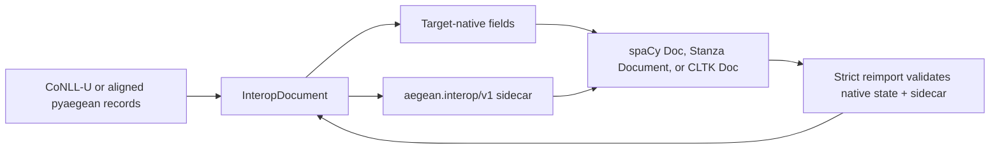

# Interoperability with spaCy, Stanza, and CLTK

pyaegean can move an aligned Ancient Greek analysis into and out of the document
objects used by spaCy, Stanza, and CLTK. The adapters are for comparison,
substitution, and mixed-tool research. They do not turn pyaegean into a wrapper
around those frameworks, and they do not assume that every framework shares one
data model.

The adapters preserve a complete pyaegean document. Each export carries a
versioned sidecar and a report that states which fields are native to the
target, which are kept in the sidecar, and which a requested projection drops.

## Install only the target you use

```bash
pip install "pyaegean[spacy]"       # spaCy Doc adapter
pip install "pyaegean[stanza]"      # Stanza Document adapter; Stanza installs PyTorch
pip install "pyaegean[cltk]"        # current CLTK Doc/Process adapter; Python 3.13+
pip install "pyaegean[interop]"     # spaCy + Stanza; CLTK is included on Python 3.13+
pip install "pyaegean[cli,interop]" # adapters plus the interop CLI commands
```

These extras are deliberately separate from `pyaegean[all]`. The pyaegean neural
pipeline stays a torch-free ONNX runtime; installing the Stanza adapter is what
brings in Stanza's separate PyTorch dependency. CLTK 2.5.1 requires Python 3.13
or newer upstream. The rest of pyaegean, including the spaCy and Stanza adapters,
keeps the project's Python 3.10 floor.

Importing `aegean` or `aegean.io` imports none of the three frameworks. A missing
target dependency produces a short install hint, and only when its adapter is
called.

## What "lossless" means here

The structural source of truth is pyaegean's complete CoNLL-U document model:
comments, all ten columns, multiword-token ranges, empty nodes, enhanced
dependencies, MISC, opaque lenient rows, and original line endings. An
`InteropDocument` adds more when those values exist:

- the source text and a stable source alignment;
- typed editorial forms, calibrated confidence, and analysis receipts;
- the inference annotation-profile identity and any composed output-profile identity;
- provenance.

The v1 sidecar carries these identities through receipts; it does not embed
custom profile objects.

No target document type represents all of that natively. Each export therefore
has two parts:

1. the target's ordinary document object, filled with every field it represents;
2. a canonical `aegean.interop/v1` JSON sidecar for the rest.

An `InteropReport` separates `native_fields`, `sidecar_fields`, and
`lost_fields`. `report.lossless` is true only when `lost_fields` is empty. The
sidecar and the native projection are hash-bound, so stale, mismatched, or
hash-inconsistent token order, text, offsets, annotations, or sidecar data make
strict reimport fail rather than silently pair unrelated data. This catches
integrity errors; it is not a digital signature.



In short: the framework object stays useful to that framework, while the sidecar
stops its narrower schema from erasing research data on the trip back.

## Field support by target

"Sidecar" means the value round-trips exactly but is not advertised as a native
target annotation.

| Field | CoNLL-U | spaCy `Doc` | Stanza `Document` | CLTK `Doc` |
| --- | --- | --- | --- | --- |
| Token text, lemma, UPOS/XPOS, morphology | native | native | native | native |
| Basic dependency head and relation | native | native | native | native |
| Sentence order and boundaries | native comments/order | native starts; IDs in sidecar | native, including `sent_id` | native boundaries; IDs in sidecar |
| Exact arbitrary whitespace and source offsets | sidecar when supplied | sidecar; spaCy has a boolean trailing-space projection | native when the object supports the exact offsets/spaces, plus sidecar | native raw offsets when the basis is exact, plus sidecar |
| Multiword-token ranges | native | sidecar | native token ranges, plus sidecar for exact row state | sidecar |
| Empty nodes and opaque rows | native | sidecar | sidecar | sidecar |
| Enhanced dependencies and ordered MISC | native | sidecar | native word strings where supported, exact state in sidecar | sidecar |
| Typed editorial form state | native reserved MISC + sidecar | sidecar | sidecar | sidecar |
| Calibrated confidence and abstention evidence | sidecar | sidecar | sidecar | selected native confidence/source fields + complete sidecar |
| Analysis receipt, inference/output profile identity, provenance | sidecar | sidecar | sidecar | namespaced metadata sidecar |

The adapters never infer offsets with `str.find()`. Repeated words, combining
marks, and normalization make that unsafe. Exact alignment must already be
present, or the report marks it unavailable.

## Python workflow

```python
from pathlib import Path

from aegean.io import from_conllu, from_spacy, to_spacy

canonical = from_conllu(Path("treebank.conllu")).value
exported = to_spacy(canonical)

doc = exported.value                 # a normal spacy.tokens.Doc
exported.report.lossless             # True: narrower fields live in the sidecar
exported.report.sidecar_fields       # exact machine-readable disclosure

restored = from_spacy(doc, sidecar=exported.sidecar).value
restored.ud_document.dumps()         # the complete canonical document is back
```

The Stanza and CLTK pairs use the same shape: `to_stanza` / `from_stanza` and
`to_cltk` / `from_cltk`. Conversion runs no model and downloads no data. It moves
annotations that already exist.

Strict framework import is the default. If a framework object has lost its
sidecar, reimport raises `InteropLossError`. A caller that deliberately wants
only the surviving native projection can opt in:

```python
projected = from_spacy(doc_without_sidecar, allow_lossy=True)
print(projected.report.lost_fields)
```

That result is useful for exchange, but it is not called lossless.

## Portable adapter bundles from the CLI

Framework objects often have version-specific binary serializers, so the CLI
uses an explicit JSON adapter bundle instead of writing a spaCy, Stanza, or CLTK
binary file. The bundle holds the target-native JSON projection, the canonical
sidecar, target and version information, and the same loss report.

```bash
aegean greek interop export treebank.conllu --target spacy -o treebank.spacy.json
aegean greek interop report treebank.spacy.json
aegean greek interop import treebank.spacy.json -o treebank-restored.conllu
```

`export` needs the selected target extra so it can build and verify the real
object. `report` and `import` validate the portable bundle without loading a
model. The imported CoNLL-U is the complete sidecar-backed document, not only the
target's word projection.

## Serializer caveats

- spaCy `Doc.to_bytes()` carries `Doc.user_data`. `DocBin` carries it only when
  created with `store_user_data=True`; the default `False` is lossy for these
  adapters.
- Stanza's standard `to_dict()` and `to_serialized()` promise its standard
  annotation fields, not arbitrary custom properties. Keep the adapter's returned
  sidecar or the CLI bundle alongside serialized Stanza data.
- CLTK has a documented free-form `Doc.metadata` mapping, which is where the
  namespaced sidecar is stored. The adapter still returns it separately, so
  integrity checks do not depend on an application preserving unrelated metadata.
- A removed or edited sidecar is never repaired by guesswork. Strict framework
  import fails, and explicit projection names what is gone.

## CLTK pipeline integration

`make_cltk_process(...)` builds a CLTK-compatible process around a pyaegean
pipeline instance that you supply. It preserves unrelated CLTK document metadata
and does not, by itself, activate a global backend, fetch a model, or make a
network call. The supplied pyaegean pipeline decides whether processing uses the
dependency-free baseline or an already-configured neural instance.

This explicit ownership matters when an application compares configurations: two
CLTK pipelines can use different pyaegean instances without touching
module-global state.

## What the adapters do not claim

- They do not train, improve, or benchmark any model. A sidecar-preserved MWT or
  empty node is a moved annotation, not a pyaegean model prediction.
- They do not convert annotation conventions. The inference and composed output
  identities travel with the analysis, and the registry exposes declared
  diagnostic mappings, but the adapters perform no source-compatible conversion.
- They do not make a stripped native projection lossless. The report always
  separates target-native support from sidecar preservation.

See [Greek NLP](Greek-NLP#lossless-conll-u-structure-and-the-model-projection) for
the underlying structural model, [Data Model](Data-Model) for source alignment and typed
forms, and [Data & Provenance](Data-and-Provenance) for receipts and citation metadata.
